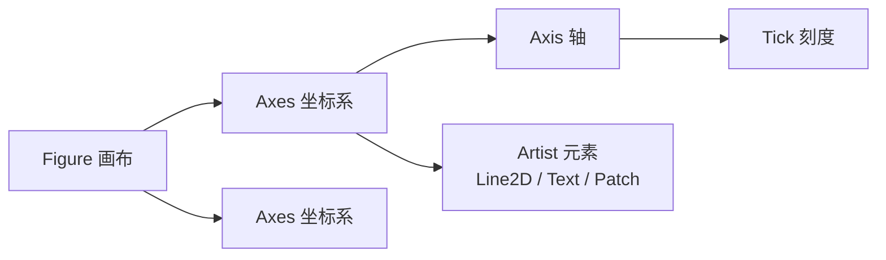

# Matplotlib 基础速查表

> 约定：`import matplotlib.pyplot as plt`，`import numpy as np`
> 示例基于 Matplotlib 3.x；标注 ⚠️ 处为版本差异或易踩的坑

## 目录

- [安装与基本概念](#安装与基本概念)
- [两种使用风格](#两种使用风格)
- [Figure / Axes / Axis](#figure--axes--axis)
- [常用绘图类型总览](#常用绘图类型总览)
- [折线图](#折线图)
- [散点图](#散点图)
- [柱状图](#柱状图)
- [直方图与分布图](#直方图与分布图)
- [饼图](#饼图)
- [误差线与区间填充](#误差线与区间填充)
- [颜色、线型与标记](#颜色线型与标记)
- [坐标轴与刻度](#坐标轴与刻度)
- [图例](#图例)
- [文本与标注](#文本与标注)
- [中文与字体](#中文与字体)
- [布局与子图](#布局与子图)
- [双轴与共享轴](#双轴与共享轴)
- [颜色映射与色条](#颜色映射与色条)
- [二维数据可视化](#二维数据可视化)
- [三维绘图](#三维绘图)
- [样式与全局配置](#样式与全局配置)
- [保存与导出](#保存与导出)
- [交互与动画](#交互与动画)
- [性能技巧](#性能技巧)
- [常见坑](#常见坑)

---

## 安装与基本概念

```bash
pip install matplotlib
pip install matplotlib[all]     # 含动画导出等可选依赖
```

**对象层级**



| 概念 | 说明 |
| --- | --- |
| `Figure` | 整张画布，可含多个 `Axes`；对应 `fig` |
| `Axes` | 一个坐标系（子图），**大部分绘图方法属于它** |
| `Axis` | x/y 轴，管理刻度、刻度标签、轴标签 |
| `Artist` | 图上所有可见元素（线、点、文字、图例…） |

> 记忆要点：`plt.xxx` 是操作"当前 Axes"的快捷方式，`ax.set_xxx` 是显式操作某个 Axes。

**后端（backend）**

```python
import matplotlib
matplotlib.use("Agg")        # 必须在 import pyplot 之前调用
import matplotlib.pyplot as plt

matplotlib.get_backend()
```

| 后端 | 场景 |
| --- | --- |
| `Agg` | 纯文件输出，无窗口（服务器/CI） |
| `TkAgg` / `QtAgg` | 桌面交互窗口 |
| `module://matplotlib_inline.backend_inline` | Jupyter 内联显示 |
| `WebAgg` | 浏览器中查看 |

---

## 两种使用风格

**1. pyplot 状态机**——快速探索、简单脚本

```python
plt.plot(x, y)
plt.title("标题")
plt.xlabel("x")
plt.grid(True)
plt.show()
```

**2. 面向对象**——推荐，尤其是多子图、需要精细控制或写成函数时

```python
fig, ax = plt.subplots(figsize=(8, 5))
ax.plot(x, y)
ax.set_title("标题")
ax.set_xlabel("x")
ax.grid(True)
fig.tight_layout()
fig.savefig("figure.png", dpi=200)
```

> ⚠️ 两种风格混用时，`plt.xxx` 作用于"最近一次创建的 Axes"，容易改错对象。多子图场景请统一用 `ax.xxx`。

**完整模板**

```python
import numpy as np
import matplotlib.pyplot as plt

def main():
    x = np.linspace(0, 2 * np.pi, 300)

    fig, ax = plt.subplots(figsize=(8, 4.5), layout="constrained")
    ax.plot(x, np.sin(x), label="sin")
    ax.plot(x, np.cos(x), linestyle="--", label="cos")

    ax.set_xlabel("x (rad)")
    ax.set_ylabel("y")
    ax.set_title("三角函数")
    ax.legend(loc="upper right")
    ax.grid(True, alpha=0.3)

    fig.savefig("trig.png", dpi=200, bbox_inches="tight")
    plt.close(fig)


if __name__ == "__main__":
    main()
```

---

## Figure / Axes / Axis

```python
# 创建
fig = plt.figure(figsize=(8, 5), dpi=120, facecolor="white")
ax = fig.add_subplot(1, 1, 1)

fig, ax = plt.subplots(figsize=(8, 5))
fig, axs = plt.subplots(2, 3, figsize=(12, 7), sharex=True, sharey=True)
fig, axs = plt.subplots(2, 2, layout="constrained")     # 自动排布，推荐

# 访问
fig.axes                    # 所有 Axes 列表
ax.figure                   # 反向获取所属 Figure
axs.flat                    # 展平后的迭代器
axs[0, 1]                   # 二维索引

# 全局元素
fig.suptitle("总标题", fontsize=14)
fig.legend(loc="lower center", ncol=3)
fig.colorbar(im, ax=ax)
fig.tight_layout()
fig.canvas.draw()           # 强制重绘
plt.close(fig)              # 释放内存
```

| 属性/方法 | 说明 |
| --- | --- |
| `figsize=(w, h)` | 英寸；像素尺寸 = `figsize * dpi` |
| `dpi=100` | 屏幕显示分辨率；保存另见 `savefig.dpi` |
| `constrained_layout` | 自动避免重叠，等价 `layout="constrained"` |
| `sharex` / `sharey` | 子图共享轴（缩放联动） |
| `squeeze=False` | 保证 `axs` 始终是二维数组 |

---

## 常用绘图类型总览

| 函数 | 用途 |
| --- | --- |
| `plot` | 折线 / 曲线 |
| `scatter` | 散点（支持逐点大小、颜色） |
| `bar` / `barh` | 垂直 / 水平柱状图 |
| `hist` | 直方图 |
| `hist2d` / `hexbin` | 二维直方图 / 六边形分箱 |
| `boxplot` / `violinplot` | 箱线图 / 小提琴图 |
| `pie` | 饼图 |
| `errorbar` | 带误差棒的数据点 |
| `fill_between` | 区间填充（置信带） |
| `stackplot` | 堆叠面积图 |
| `step` | 阶梯图 |
| `stem` | 茎叶图 |
| `eventplot` | 事件序列（栅格图） |
| `pie` | 饼图 |
| `imshow` | 图像 / 矩阵热图 |
| `pcolormesh` | 非均匀网格伪彩色图 |
| `contour` / `contourf` | 等高线 / 填充等高线 |
| `quiver` / `streamplot` | 矢量场 / 流线图 |
| `ecdf` | 经验累积分布（3.4+） |
| `spy` | 稀疏矩阵非零结构 |
| `plot_date` | 时间序列（旧接口，现多用 `plot` 直接传日期） |

---

## 折线图

```python
x = np.linspace(0, 2 * np.pi, 200)

fig, ax = plt.subplots(figsize=(8, 4.5))
ax.plot(x, np.sin(x), label="sin")
ax.plot(x, np.cos(x), linestyle="--", linewidth=2, label="cos")
ax.set_xlabel("x (rad)")
ax.set_ylabel("y")
ax.set_title("三角函数")
ax.legend()
ax.grid(True, alpha=0.3)
```

**多组曲线**

```python
ys = np.array([np.sin(x + p) for p in np.linspace(0, np.pi, 5)])
ax.plot(x, ys.T, label=[f"相位 {p:.2f}" for p in np.linspace(0, np.pi, 5)])
```

**双 y 轴 / 对数轴**

```python
ax.set_yscale("log")
ax.set_xscale("log")            # "linear" / "log" / "symlog" / "logit"
```

---

## 散点图

```python
rng = np.random.default_rng(0)
x = rng.normal(size=300)
y = rng.normal(size=300)
c = np.hypot(x, y)          # 每点颜色
s = 20 + 300 * rng.random(300)   # 每点大小

fig, ax = plt.subplots(figsize=(7, 6))
sc = ax.scatter(x, y, c=c, s=s, cmap="viridis", alpha=0.7,
                edgecolors="none", linewidths=0)
fig.colorbar(sc, ax=ax, label="到原点距离")
ax.set_xlabel("x")
ax.set_ylabel("y")
```

| 参数 | 说明 |
| --- | --- |
| `s` | 点面积（**平方点**，不是直径） |
| `c` | 单色字符串 / 颜色列表 / 数值数组（配合 `cmap`） |
| `marker` | `"o"` `"s"` `"^"` `"D"` `"*"` `"x"` `"+"` `"P"` |
| `alpha` | 透明度，密集中大量点必用 |
| `edgecolors="none"` | 去掉描边，渲染更快、更干净 |

---

## 柱状图

```python
labels = ["A", "B", "C", "D"]
vals = [3, 7, 5, 9]
errs = [0.4, 0.6, 0.3, 0.8]

fig, ax = plt.subplots()
bars = ax.bar(labels, vals, yerr=errs, capsize=4,
              color="#4C72B0", width=0.6)
ax.bar_label(bars, fmt="%.1f", padding=3)      # 3.4+ 自动标数值
ax.set_ylabel("数量")
ax.set_ylim(0, 11)
```

**分组柱状**

```python
xpos = np.arange(len(labels))
w = 0.35
ax.bar(xpos - w / 2, [3, 7, 5, 9], w, label="组 1")
ax.bar(xpos + w / 2, [5, 4, 8, 6], w, label="组 2")
ax.set_xticks(xpos, labels)          # 用位置索引 + 标签
ax.legend()
```

**堆叠柱状 / 百分比柱状**

```python
ax.bar(labels, [3, 7, 5, 9], label="部分 1")
ax.bar(labels, [2, 1, 3, 1], bottom=[3, 7, 5, 9], label="部分 2")
ax.legend()

# 百分比堆叠：先把每组归一化到 1
data = np.array([[3, 7, 5, 9], [2, 1, 3, 1]], dtype=float)
pct = data / data.sum(axis=0)
bottom = np.zeros(len(labels))
for row, name in zip(pct, ["部分 1", "部分 2"]):
    ax.bar(labels, row, bottom=bottom, label=name)
    bottom += row
```

**水平柱状**（类别名较长时更好）

```python
ax.barh(labels, vals, color="tab:green")
ax.invert_yaxis()          # 让第一项显示在最上方
```

---

## 直方图与分布图

```python
data = rng.normal(size=2000)

fig, ax = plt.subplots()
ax.hist(data, bins=40, density=True, alpha=0.7,
        edgecolor="white", linewidth=0.5, label="样本")

# 叠加理论正态曲线
xs = np.linspace(-4, 4, 300)
ax.plot(xs, np.exp(-xs ** 2 / 2) / np.sqrt(2 * np.pi), "r-", lw=2, label="N(0,1)")
ax.legend()
ax.set_xlabel("值")
ax.set_ylabel("概率密度")
```

| 参数 | 说明 |
| --- | --- |
| `bins` | 整数 / 序列 / 字符串（`"auto"`、`"fd"`、`"sturges"`） |
| `density` | `True` 时归一化为概率密度（面积为 1） |
| `cumulative` | `True` 画累积分布 |
| `histtype` | `"bar"` / `"step"` / `"stepfilled"` |
| `weights` | 加权；⚠️ 与 `density=True` 组合会触发警告 |

**只算数据不画图**

```python
counts, edges = np.histogram(data, bins=40, density=True)
centers = (edges[:-1] + edges[1:]) / 2
```

**箱线图 / 小提琴图**

```python
groups = [rng.normal(i, 1, 300) for i in range(4)]

fig, ax = plt.subplots()
ax.boxplot(groups, tick_labels=["A", "B", "C", "D"],
           showmeans=True, patch_artist=True,
           boxprops={"facecolor": "#B0C4DE"})
# ⚠️ 3.9 起参数名由 labels= 改为 tick_labels=
ax.grid(axis="y", alpha=0.3)

ax.violinplot(groups, showmeans=True, showmedians=True)
```

**其他分布图**

```python
ax.ecdf(data)                     # 经验累积分布（3.4+）
ax.eventplot([np.sort(rng.random(20)) for _ in range(5)])   # 事件栅格
ax.stem(x[:20], np.sin(x[:20]))   # 茎叶图
```

---

## 饼图

```python
fig, ax = plt.subplots(figsize=(6, 6))
ax.pie([35, 25, 20, 20],
       labels=["A", "B", "C", "D"],
       autopct="%1.1f%%",         # 显示百分比，可传格式化函数
       startangle=90,             # 从 12 点方向开始
       counterclock=False,        # 顺时针
       explode=(0.05, 0, 0, 0),   # 突出某一块
       shadow=False,
       wedgeprops={"edgecolor": "white", "linewidth": 1.5},
       textprops={"fontsize": 10})
ax.set_aspect("equal")            # 保证是正圆
ax.set_title("占比")
```

**环形图**

```python
ax.pie(vals, radius=1.0, wedgeprops={"width": 0.35, "edgecolor": "white"})
```

> ⚠️ 饼图不适合比较 5 个以上类别或相近数值，此时用横向柱状图更易读。

---

## 误差线与区间填充

```python
x = np.linspace(0, 10, 20)
y = np.sin(x)
yerr = 0.15 + 0.05 * rng.random(20)

# 误差棒
ax.errorbar(x, y, yerr=yerr, fmt="o", capsize=4,
            color="tab:blue", ecolor="gray", elinewidth=1, label="观测")
# fmt=None 时只画误差线，不画数据点

# 置信带
ax.plot(x, y, "k-", lw=1.5)
ax.fill_between(x, y - 0.3, y + 0.3, alpha=0.25, color="tab:blue", label="95% CI")

# 水平方向的区间
ax.fill_betweenx([0, 1], 2, 4, alpha=0.2)

# 堆叠面积
ax.stackplot(x, np.sin(x) + 2, np.cos(x) + 2,
             labels=["A", "B"], alpha=0.8, baseline="zero")
ax.legend()

# 阶梯图
ax.step(x, y, where="mid")        # where: "pre" / "post" / "mid"
```

---

## 颜色、线型与标记

**单字母简写**

| 字母 | 颜色 | 字母 | 颜色 |
| --- | --- | --- | --- |
| `b` | blue | `m` | magenta |
| `g` | green | `y` | yellow |
| `r` | red | `k` | black |
| `c` | cyan | `w` | white |

**线型 `linestyle`**

`-` 实线 ｜ `--` 虚线 ｜ `-.` 点划线 ｜ `:` 点线 ｜ `""` / `"None"` 无线

**标记 `marker`**

| 字符 | 形状 | 字符 | 形状 |
| --- | --- | --- | --- |
| `o` | 圆 | `s` | 方块 |
| `^` `v` `<` `>` | 三角 | `D` | 菱形 |
| `*` | 星 | `P` / `p` | 加粗十字 / 五边形 |
| `x` / `+` | 叉 / 加 | `.` | 小点 |
| `_` | 水平线 | `1`~`4` | 三叉戟 |

**颜色指定方式**

```python
ax.plot(x, y, color="tab:blue")        # 命名色（含 tab: / CSS 颜色名）
ax.plot(x, y, color="#1f77b4")         # 十六进制
ax.plot(x, y, color=(0.2, 0.4, 0.6))   # RGB 元组（0~1）
ax.plot(x, y, color=(0.2, 0.4, 0.6, 0.5))   # RGBA
ax.plot(x, y, color="C0")              # 属性循环配色 C0 ~ C9
```

**样式简写**

```python
ax.plot(x, y, "ro--")                  # 红色圆点 + 虚线
ax.plot(x, y, "k.-", lw=0.8)           # 黑点 + 实线
```

**完整参数示例**

```python
ax.plot(x, y,
        color="tab:blue",
        linewidth=2,
        linestyle="--",
        marker="o",
        markersize=5,
        markerfacecolor="white",
        markeredgecolor="tab:blue",
        markeredgewidth=1.2,
        markevery=5,            # 每 5 个点画一个标记
        alpha=0.85,
        zorder=3,               # 绘制层级
        label="系列 1")
```

**取用配色循环的颜色**

```python
prop_cycle = plt.rcParams["axes.prop_cycle"]
colors = prop_cycle.by_key()["color"]     # ['#1f77b4', '#ff7f0e', ...]
```

---

## 坐标轴与刻度

```python
# 范围与比例
ax.set_xlim(0, 10)
ax.set_ylim(-2, 2)
ax.set_xscale("log")
ax.invert_xaxis()              # 反向
ax.set_aspect("equal")         # 等比例（圆不被压扁）

# 刻度位置与标签
ax.set_xticks([0, 2, 4, 6, 8, 10])
ax.set_xticks([0, 1, 2], labels=["低", "中", "高"])
ax.set_xticklabels(ax.get_xticklabels(), rotation=45, ha="right")
ax.tick_params(axis="both", which="major",
               direction="in", length=4, width=0.8,
               labelsize=9, colors="dimgray")
ax.tick_params(axis="x", labelrotation=30)

# 轴标签
ax.set_xlabel("时间 (s)", fontsize=11)
ax.set_ylabel("幅度", fontsize=11)
ax.set_title("标题", fontsize=13, pad=12)

# 精细控制刻度
from matplotlib.ticker import (
    MultipleLocator, AutoMinorLocator, FuncFormatter,
    PercentFormatter, EngFormatter, LogLocator,
)

ax.xaxis.set_major_locator(MultipleLocator(1))       # 主刻度每 1 一个
ax.xaxis.set_minor_locator(AutoMinorLocator(2))      # 每主刻度间 2 个次刻度
ax.xaxis.set_major_formatter(PercentFormatter(1.0))  # 0~1 → 百分比
ax.xaxis.set_major_formatter(FuncFormatter(lambda v, _: f"{v:.0f} ms"))
ax.yaxis.set_major_formatter(EngFormatter(unit="W"))

# 网格
ax.grid(True, which="major", linestyle=":", alpha=0.4)
ax.grid(True, which="both")
ax.set_axisbelow(True)         # 网格置于数据下方

# 参考线与参考区
ax.axhline(0, color="gray", lw=1)
ax.axvline(np.pi, color="gray", ls="--", lw=1)
ax.axhspan(0.5, 1.0, color="yellow", alpha=0.15)
ax.axvspan(2, 4, color="red", alpha=0.1)

# 边框（spines）
ax.spines["top"].set_visible(False)
ax.spines["right"].set_visible(False)
ax.spines["left"].set_color("gray")

# 隐藏轴
ax.set_axis_off()
```

**对数轴的坑**：`set_xscale("log")` 后不可出现 ≤0 的值，否则报错或异常；刻度用 `LogLocator` / `LogFormatterSciNotation` 控制。

---

## 图例

```python
ax.plot(x, y1, label="系列 1")
ax.plot(x, y2, label="系列 2")

ax.legend()                                    # 自动取 label
ax.legend(loc="upper right", ncol=2, fontsize=9,
          frameon=True, title="图例标题", framealpha=0.9)

# 放到坐标区外（推荐 bbox_to_anchor + loc）
ax.legend(loc="upper left", bbox_to_anchor=(1.02, 1))

# 整图共用图例
handles, labels = ax.get_legend_handles_labels()
fig.legend(handles, labels, loc="lower center", ncol=3, frameon=False)

# 手动指定
from matplotlib.lines import Line2D
ax.legend(handles=[Line2D([], [], color="r", lw=2, label="理论")])
```

**`loc` 取值**：`best`（默认，自动避让）｜`upper right` / `upper left` / `lower right` / `lower left`｜`upper center` / `lower center` /`center`｜`center left` / `center right`｜`right` / `left`

> ⚠️ 未设置 `label` 的曲线会带 `_child` 前缀出现在图例中（`_nolegend_` 可屏蔽）。

---

## 文本与标注

```python
# 数据坐标下的文本
ax.text(1.0, 0.5, "普通文本", fontsize=10, color="gray",
        ha="center", va="bottom", rotation=0)

# 相对坐标（0~1，便于自适应）
ax.text(0.02, 0.95, "左上角注释", transform=ax.transAxes,
        va="top", fontsize=9, bbox=dict(boxstyle="round,pad=0.3",
        facecolor="lightyellow", edgecolor="gray", alpha=0.9))

# 带箭头标注
ax.annotate("局部峰值",
            xy=(np.pi / 2, 1.0),                    # 箭头指向的点
            xytext=(np.pi / 2 + 0.8, 0.55),         # 文字位置
            arrowprops=dict(arrowstyle="->", color="gray", lw=1.2,
                            connectionstyle="arc3,rad=0.2"),
            fontsize=10, ha="left")

# 常用箭头样式
# "-"      直箭头
# "->"     带箭头直线
# "fancy"  带填充的弧形箭头
# "wedge"  楔形
```

**坐标系变换**

| 变换 | 含义 |
| --- | --- |
| `ax.transData` | 数据坐标（默认） |
| `ax.transAxes` | Axes 内相对坐标（0~1） |
| `fig.transFigure` | 整图相对坐标（0~1） |
| `ax.transAxes.inverted()` | 反向变换 |

```python
ax.annotate("A", xy=(0.5, 0.5), xycoords="axes fraction", textcoords="offset points",
            xytext=(10, 10))
```

---

## 中文与字体

**全局设置（推荐）**

```python
plt.rcParams["font.sans-serif"] = [
    "Noto Sans CJK SC",        # Linux 常见
    "Source Han Sans SC",
    "WenQuanYi Micro Hei",
    "PingFang SC",             # macOS
    "Microsoft YaHei",         # Windows
    "SimHei",
]
plt.rcParams["axes.unicode_minus"] = False    # 负号正常显示，而非方块
```

**查找系统可用字体**

```python
from matplotlib import font_manager

[f.name for f in font_manager.fontManager.ttflist if "CJK" in f.name]
font_manager.findfont("Noto Sans CJK SC")
```

**局部指定字体文件**（无需改全局，最稳）

```python
from matplotlib.font_manager import FontProperties

fp = FontProperties(fname="/usr/share/fonts/opentype/noto/NotoSansCJK-Regular.ttc")
ax.set_title("中文标题", fontproperties=fp)
ax.set_xlabel("横轴", fontproperties=fp)
```

**清理字体缓存**（改了字体仍无效时）

```bash
rm -rf ~/.cache/matplotlib
```

> ⚠️ 中文乱码的两个独立原因：① 字体不含中文；② 缺字体但没关 `axes.unicode_minus` 导致负号变方框。两者都要处理。

---

## 布局与子图

**规则网格**

```python
fig, axs = plt.subplots(2, 3, figsize=(12, 7),
                        sharex=True, sharey=True,
                        layout="constrained")
axs[0, 0].plot(x, y)
for ax in axs.flat:
    ax.grid(alpha=0.3)
fig.suptitle("2×3 子图", fontsize=14)
```

| 布局方式 | 说明 |
| --- | --- |
| `layout="constrained"` | 自动避让，**推荐**，与 `suptitle` / `colorbar` 兼容好 |
| `fig.tight_layout()` | 事后调整，简单场景够用 |
| `subplots_adjust(wspace=, hspace=)` | 手动指定间距 |
| 三者混用会相互覆盖，选一个 |

**不规则布局（GridSpec）**

```python
from matplotlib.gridspec import GridSpec

fig = plt.figure(figsize=(10, 7), layout="constrained")
gs = GridSpec(3, 3, figure=fig)

ax1 = fig.add_subplot(gs[0, :])       # 跨全部列
ax2 = fig.add_subplot(gs[1:, :2])     # 后两行、前两列
ax3 = fig.add_subplot(gs[1, 2])
ax4 = fig.add_subplot(gs[2, 2])
ax1.set_title("顶部横跨")

# 嵌套
from matplotlib.gridspec import GridSpecFromSubplotSpec
sub = GridSpecFromSubplotSpec(2, 1, subplot_spec=gs[1, 2])
fig.add_subplot(sub[0])
fig.add_subplot(sub[1])

# 宽度/高度比例
gs = GridSpec(2, 2, width_ratios=[2, 1], height_ratios=[1, 3])
```

**在已有图上手工放置**

```python
ax_inset = fig.add_axes([0.62, 0.6, 0.25, 0.25])   # [left, bottom, width, height]
ax_inset.plot(x, y)
```

---

## 双轴与共享轴

```python
fig, ax1 = plt.subplots(figsize=(8, 5))

ax2 = ax1.twinx()      # 共享 x 轴，新增右侧 y 轴
ax3 = ax1.twiny()      # 共享 y 轴，新增顶部 x 轴

l1, = ax1.plot(x, np.sin(x), color="tab:blue", label="sin")
l2, = ax2.plot(x, 100 * np.cos(x), color="tab:red", label="cos × 100")

ax1.set_ylabel("sin", color="tab:blue")
ax2.set_ylabel("cos × 100", color="tab:red")
ax1.tick_params(axis="y", colors="tab:blue")
ax2.tick_params(axis="y", colors="tab:red")

ax1.legend(handles=[l1, l2], loc="upper center", ncol=2)
```

> ⚠️ `twinx()` 的新轴默认盖在上层，可能遮住原轴的数据。需要时把原轴提到前面：

```python
ax1.set_zorder(ax2.get_zorder() + 1)
ax1.patch.set_visible(False)
```

**共享轴的刻度标签**

`sharex=True` 时只有最底部子图显示 x 刻度标签，其余自动隐藏；如需强制显示：`ax.tick_params(labelbottom=True)`。

---

## 颜色映射与色条

```python
im = ax.imshow(Z, cmap="viridis", vmin=0, vmax=1)
cbar = fig.colorbar(im, ax=ax, label="强度")
cbar.set_ticks([0, 0.5, 1.0])
cbar.ax.tick_params(labelsize=9)

# 水平色条 / 指定位置
fig.colorbar(im, ax=ax, orientation="horizontal", pad=0.08, fraction=0.05, aspect=40)

# 对数色标
from matplotlib.colors import LogNorm, TwoSlopeNorm, BoundaryNorm
im = ax.imshow(Z, norm=LogNorm(vmin=1e-3, vmax=1))
im = ax.imshow(Z, norm=TwoSlopeNorm(vcenter=0), cmap="RdBu_r")   # 发散数据

# 离散分级色标
bounds = [0, 0.2, 0.5, 0.8, 1.0]
norm = BoundaryNorm(bounds, ncolors=256)
fig.colorbar(ax.pcolormesh(X, Y, Z, norm=norm, cmap="viridis"), extend="both")

# 自定义线性色图
from matplotlib.colors import LinearSegmentedColormap
cmap = LinearSegmentedColormap.from_list("my", ["#2c7bb6", "white", "#d7191c"])

# 列出现有配色
plt.colormaps()                      # 3.5+
plt.get_cmap("viridis")(0.5)         # 取色
```

| 配色 | 适用 |
| --- | --- |
| `viridis` / `plasma` / `magma` / `inferno` | 连续量，感知均匀，**默认首选** |
| `cividis` | 色盲友好 |
| `RdBu_r` / `coolwarm` | 以 0 为中心的发散数据 |
| `Greys` / `Blues` | 单色顺序 |
| `tab10` / `Set2` / `Paired` | 分类（离散） |

---

## 二维数据可视化

```python
Z = rng.random((20, 30))

# 热图 / 矩阵
im = ax.imshow(Z, cmap="viridis", origin="lower", aspect="auto",
               extent=[0, 30, 0, 20], vmin=0, vmax=1, interpolation="nearest")
fig.colorbar(im, ax=ax)

# 网格化等高线
X, Y = np.meshgrid(np.linspace(-3, 3, 200), np.linspace(-3, 3, 200))
Z = np.sin(X) * np.cos(Y)

cs = ax.contour(X, Y, Z, levels=10, cmap="RdBu_r")
ax.clabel(cs, inline=True, fontsize=8, fmt="%.1f")     # 标等高线数值
cf = ax.contourf(X, Y, Z, levels=20, cmap="RdBu_r")    # 填充
fig.colorbar(cf, ax=ax)

# 非均匀网格伪彩色（比 imshow 更适合真实坐标）
ax.pcolormesh(X, Y, Z, cmap="viridis", shading="auto", rasterized=True)

# 矢量场
U, V = -np.sin(Y), np.cos(X)
ax.streamplot(X, Y, U, V, density=1.2, color=np.hypot(U, V), cmap="viridis")
ax.quiver(X[::20, ::20], Y[::20, ::20], U[::20, ::20], V[::20, ::20])

# 图片显示
img = plt.imread("photo.png")     # → (H, W) 或 (H, W, 3/4) 的 0~1 数组
ax.imshow(img)
ax.axis("off")
```

| | `imshow` | `pcolormesh` | `contourf` |
| --- | --- | --- | --- |
| 数据 | 等距像素矩阵 | 任意四边形网格 | 网格 + 等高线 |
| 坐标 | 用 `extent` 模拟 | 真实坐标数组 | 真实坐标数组 |
| 适合 | 图像、矩阵、热图 | 不规则网格数据 | 平滑场分布 |

> ⚠️ `imshow` 默认 `origin="upper"`（第 0 行在顶部），画矩阵/地图时通常要 `origin="lower"`；默认 `aspect="equal"` 会保持像素方正，宽扁数据需 `aspect="auto"`。

---

## 三维绘图

```python
fig = plt.figure(figsize=(9, 7))
ax = fig.add_subplot(projection="3d")

X, Y = np.meshgrid(np.linspace(-5, 5, 60), np.linspace(-5, 5, 60))
Z = np.sin(np.hypot(X, Y))

surf = ax.plot_surface(X, Y, Z, cmap="viridis", alpha=0.9,
                       linewidth=0, antialiased=True, rstride=1, cstride=1)
fig.colorbar(surf, ax=ax, shrink=0.6, label="Z")

ax.contour(X, Y, Z, zdir="z", offset=-1.2, cmap="viridis", levels=15)
ax.set_xlabel("X"); ax.set_ylabel("Y"); ax.set_zlabel("Z")
ax.view_init(elev=30, azim=-60)      # 视角：仰角 / 方位角

# 三维曲线与散点
t = np.linspace(0, 4 * np.pi, 500)
ax.plot(np.cos(t), np.sin(t), t, lw=2)
ax.scatter(xs, ys, zs, c=zs, cmap="plasma", s=20)

# 其他类型
ax.plot_wireframe(X, Y, Z, rstride=4, cstride=4, lw=0.5)
ax.plot_trisurf(x, y, z, cmap="viridis")     # 散点三角剖分曲面
ax.quiver(x, y, z, u, v, w)
```

> ⚠️ 3D 图在 `Agg` 等非交互后端无法旋转查看；渲染很慢时降低网格密度（`rstride`/`cstride`）或改用 `plot_surface` + `rasterized=True`。

---

## 样式与全局配置

```python
plt.style.use("seaborn-v0_8-whitegrid")
plt.style.available                       # 列出全部内置样式

with plt.style.context("dark_background"):    # 临时生效，退出后恢复
    fig, ax = plt.subplots()
    ax.plot(x, y)

plt.rcdefaults()                          # 恢复出厂设置
plt.rcParams.update({                     # 全局统一配置
    "figure.figsize": (8, 5),
    "figure.dpi": 110,
    "savefig.dpi": 300,
    "font.size": 11,
    "axes.titlesize": 13,
    "axes.labelsize": 11,
    "axes.grid": True,
    "grid.alpha": 0.3,
    "grid.linestyle": ":",
    "lines.linewidth": 1.8,
    "legend.frameon": False,
    "figure.constrained_layout.use": True,
})
```

**常用内置样式**

`default` ｜ `classic` ｜ `ggplot` ｜ `bmh` ｜ `fivethirtyeight` ｜ `dark_background` ｜ `seaborn-v0_8` 系列（`-whitegrid` / `-darkgrid` / `-white` / `-dark` / `-ticks` / `-notebook` / `-paper` / `-talk` / `-poster`）

**局部样式覆盖**

```python
with plt.rc_context({"font.size": 14, "axes.grid": False}):
    fig, ax = plt.subplots()
    ax.plot(x, y)
```

---

## 保存与导出

```python
fig.savefig("plot.png", dpi=300, bbox_inches="tight",
            transparent=False, facecolor="white", pad_inches=0.1)

fig.savefig("plot.pdf")                       # 矢量，论文首选
fig.savefig("plot.svg")                       # 矢量，网页用
fig.savefig("plot.eps")                       # 部分期刊要求
fig.savefig("plot.jpg", pil_kwargs={"quality": 95})
fig.savefig("plot.webp", dpi=150)
```

| 参数 | 说明 |
| --- | --- |
| `dpi` | 输出分辨率；网页 150、印刷 300+ |
| `bbox_inches="tight"` | 裁掉多余白边，避免标签被切；会改变实际尺寸 |
| `transparent=True` | 透明背景（需 `facecolor` 配合） |
| `format` | 可由文件后缀推断，也可显式指定 |
| `metadata` | 嵌入作者等信息，PDF/SVG 用 |

> ⚠️ `plt.savefig` 保存的是"当前图"，多图场景务必用 `fig.savefig`。另外**先 `savefig` 再 `show`**——某些后端 `show()` 后会关闭图形。

---

## 交互与动画

**事件回调**

```python
def on_click(event):
    if event.inaxes is not None:
        print(f"x={event.xdata:.3f}  y={event.ydata:.3f}")

cid = fig.canvas.mpl_connect("button_press_event", on_click)
fig.canvas.mpl_disconnect(cid)
```

常用事件：`button_press_event` ｜ `button_release_event` ｜ `motion_notify_event` ｜ `key_press_event` ｜ `scroll_event` ｜ `resize_event` ｜ `close_event`

**动画**

```python
from matplotlib.animation import FuncAnimation

fig, ax = plt.subplots()
ax.set_xlim(0, 2 * np.pi)
ax.set_ylim(-1.2, 1.2)
xs = np.linspace(0, 2 * np.pi, 200)
(line,) = ax.plot(xs, np.sin(xs))

def update(frame):
    line.set_ydata(np.sin(xs + frame / 10))    # 复用对象，避免重画
    return (line,)

anim = FuncAnimation(fig, update, frames=100, interval=50, blit=True)
anim.save("anim.gif", writer="pillow", fps=20)     # GIF
# anim.save("anim.mp4", writer="ffmpeg", fps=30)   # MP4 需安装 ffmpeg
plt.show()
```

**交互控件**

```python
from matplotlib.widgets import Slider, Button, RadioButtons, Cursor, SpanSelector
```

---

## 性能技巧

**1. 复用 Artist，而非反复 `plot`**

```python
(line,) = ax.plot([], [], "-")      # 解包出 Line2D
# 动画中只更新数据
line.set_data(xs, ys_new)
fig.canvas.draw_idle()
```

**2. 减少数据点与描边**

```python
ax.plot(x, y, markevery=10)                     # 每 10 点画一个标记
ax.scatter(x, y, s=6, edgecolors="none", rasterized=True)
```

**3. 海量点改用统计型图**

```python
ax.hexbin(x, y, gridsize=50, cmap="Blues", mincnt=1)
ax.hist2d(x, y, bins=100, cmap="Blues")
```

**4. 矢量图元素栅格化**

```python
ax.pcolormesh(X, Y, Z, rasterized=True)         # PDF 中嵌入位图，体积骤降
```

**5. 关闭不必要的开销**

```python
plt.rcParams["path.simplify"] = True            # 默认已开启，简化路径
plt.rcParams["agg.path.chunksize"] = 10000      # 大折线分块渲染，提升内存表现
ax.autoscale(False)                             # 固定范围时避免重复计算
```

**6. 批量保存时用 Agg 后端**

```python
import matplotlib
matplotlib.use("Agg")
```

**7. 及时释放**

```python
plt.close(fig)        # 或 plt.close("all")
```

---

## 常见坑

**1. 中文显示为方块**

同时设置中文字体与 `axes.unicode_minus = False`，详见[中文与字体](#中文与字体)。

**2. 负号变成方框**

即使字体支持中文，若 `axes.unicode_minus=True` 且默认字体无 U+2212，负号仍会异常。

**3. Jupyter 中重复执行导致图形叠加**

```python
%matplotlib inline
# 每个 cell 里显式创建 fig/ax，或结尾 plt.close(fig)
```

**4. `plt.savefig` 保存了错误的图**

多图场景用 `fig.savefig(...)`，不要依赖"当前图"。

**5. `imshow` 上下颠倒 / 被拉伸**

```python
ax.imshow(Z, origin="lower", aspect="auto")     # 矩阵习惯 + 不保持像素方形
```

**6. `sharex=True` 后看不到子图刻度标签**

```python
ax.tick_params(labelbottom=True)
```

**7. `twinx()` 后原轴线条被遮挡**

```python
ax1.set_zorder(ax2.get_zorder() + 1)
ax1.patch.set_visible(False)
```

**8. `boxplot` 的 `labels=` 报错**

3.9 起改名为 `tick_labels=`。

**9. `hist` 的 `density` 与 `weights` 冲突**

二者同用会触发警告且语义不清；需加权归一化时自行处理：

```python
w = np.ones_like(data) / len(data)
ax.hist(data, bins=30, weights=w)
```

**10. `set_xscale("log")` 遇到 0 或负数**

数据需先过滤：`data = data[data > 0]`；或改用 `symlog`。

**11. 图例不显示**

曲线未设置 `label`，或 `ax.legend()` 在 `plot` 之前调用（顺序无关，但没 label 就没条目）。

**12. `bbox_inches="tight"` 后尺寸变了**

保存尺寸 = 内容包围盒，不再等于 `figsize`。需要严格尺寸时去掉该参数或事后用 `subplots_adjust` 留边。

**13. 子图标题重叠**

用 `layout="constrained"`，或调 `fig.suptitle(..., y=1.02)` 与 `fig.tight_layout(rect=[0, 0, 1, 0.96])`。

**14. 3D 图标签被裁切**

```python
fig.tight_layout()
fig.subplots_adjust(left=0.05, right=0.95, bottom=0.05, top=0.95)
```

**15. 中文字体缓存不更新**

改了字体仍无效时删除缓存目录：`rm -rf ~/.cache/matplotlib`。

**16. `figsize` 与 `dpi` 决定像素数**

`figsize=(8, 5)` + `dpi=300` → 2400 × 1500 px。论文投稿常要求宽度单栏 ~3.5 inch、双栏 ~7 inch。

---

## 参考

- 官方文档：https://matplotlib.org/stable/
- 速查手册（PDF）：https://matplotlib.org/cheatsheets/
- 示例库（按图类型检索）：https://matplotlib.org/stable/gallery/index.html
- 教程：https://matplotlib.org/stable/tutorials/index.html
- 配色选择指南：https://matplotlib.org/stable/users/explain/colors/colormaps.html
- 本仓库其他笔记：[NumPy](numpy_basics.md) · [SciPy](scipy_basics.md) · [pandas](pandas_basics.md)
